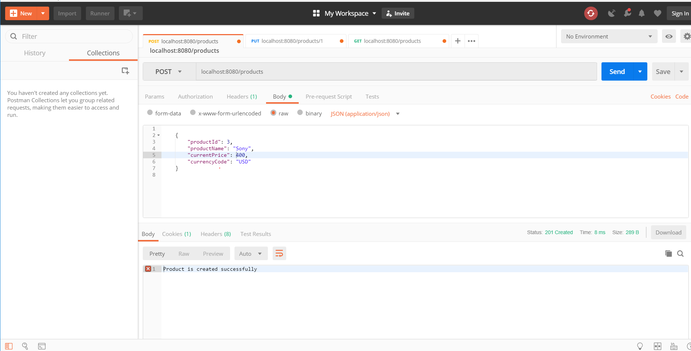

# Technology stack

 java, springboot, maven, log4j, spring data and mysql.

# Testing

Using postman, you can test the following endpoints:

•	Get method localhost:8080/product/{id} where id is Integer. This endpoint is used to get a product by id. 

•	Get method localhost:8080/products. To get all products. 

•	Post method, localhost:8080/products. Gets json request and saves it.

•	Put method, localhost:8080/products/{id} to update product by id

# Sample screenshots

CREATE A PRODUCT

GET ALL PRODUCTS

GET PRODUCT BY ID

UPDATE PRODUCT

